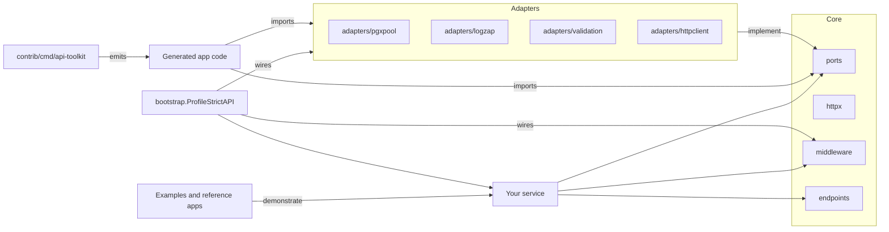

# Hexagonal Architecture Mapping

Audience: developers and maintainers who need the boundary map between stable
core packages and third-party contrib adapters.

This repository follows hexagonal (ports and adapters) architecture:

- Core defines domain contracts and HTTP primitives.
- Adapters implement ports for real integrations.
- Bootstrap wires middleware and adapters into a runnable service.

## Boundary Map

| Surface | Location | API promise | May depend on | Must not depend on |
| --- | --- | --- | --- | --- |
| Stable core packages | root packages listed as `stable` or `compatibility-only` in `docs/package-classification.tsv` | v3 SemVer compatibility for exported APIs | stdlib, allowed root module dependencies, and other stable root packages | contrib, provider SDKs, database drivers, router adapters, scaffold-only packages, generated app code, examples, or reference apps |
| Core implementation-sharing packages | root packages listed as `experimental`, `test-only`, `tooling`, or `excluded` | No stable API promise unless promoted | root packages and package-local helpers | contrib runtime adapters unless the package is explicitly tooling/test-only and excluded from the stable API surface |
| Contrib adapters and integrations | `contrib/adapters/*`, `contrib/integrations/*`, `contrib/middleware/*`, and related contrib packages | Supported-adapter or experimental policy from package classification | core ports/contracts, provider SDKs, database drivers, router adapters, and contrib test contracts | generated app internals or reference-service internals |
| Bootstrap composition | `contrib/bootstrap` | Supported-adapter policy | stable core, supported contrib adapters, and service-supplied options | app business logic, generated app internals, or provider-specific secrets in source |
| CLI and generators | `contrib/cmd/api-toolkit` | Tooling policy, not stable root API | templates, contrib tooling helpers, and generated-fixture tests | stable core internals that would make generated app code a hidden root dependency |
| Generated application code | generated service output and `examples/reference-saas-api` | App-owned generated code | stable core, selected contrib adapters, and application packages | stable core package internals or assumptions that generated app code is part of the root API promise |
| Examples and reference apps | `contrib/examples/*` and `examples/reference-saas-api` | Runnable adoption evidence | stable core, contrib adapters, and local app code | package internals that would teach unsupported coupling |

## Forbidden Dependency Directions

- Stable core packages must not import contrib, scaffold-only packages, provider
  SDKs, database drivers, router adapters, generated application code,
  reference-service code, or example code.
- In review shorthand: stable core packages must not import contrib, scaffold-only packages, provider SDKs, database drivers, router adapters, generated application code, reference-service code, or example code.
- Contrib packages may import stable core packages, but stable core packages may
  not import contrib packages.
- Generated application code may import stable core and selected contrib
  adapters, but core and contrib packages must not import generated application
  internals.
- Examples may import public packages, but public packages must not import
  examples.
- Provider-specific contracts belong in contrib or application code unless a
  stable-core design note proves broad adapter-neutral reuse.

## Diagram

## Practical Wiring

1. Define ports in core to avoid vendor lock-in where the boundary can stay generic.
2. Pick adapters (contrib) that implement those ports.
3. Use bootstrap profiles to apply middleware consistently.
4. Keep business logic in handlers/services, not in adapters.

This keeps the core stable while allowing integrations to change independently.
The executable boundary guardrail is `make dependency-boundary-check`; CI runs
it through the governance workflow and `make docs-check`.

## Stable Boundary Clarifications

- Most of `ports` is intended to stay adapter-neutral and reusable across applications.
- Hosted-checkout billing contracts live in the explicit compatibility package
  `github.com/aatuh/api-toolkit/v3/compat/billing`; generic `ports` should not
  grow provider-shaped billing APIs.
- Database pool observability should prefer `DatabasePoolSnapshotProvider`,
  `SnapshotDatabasePoolStats`, or adapter `StatSnapshot()` methods so
  driver-shaped counters stay inside adapters.
- New provider-specific or driver-specific contracts should live in app code, `contrib`, or a dedicated future module instead of widening the stable core package.
- The planned v3 extraction path for these surfaces is documented in `docs/ports-surface.md`.

## Operational Safety Contracts

- Health handlers treat probe configuration as part of the contract: liveness
  and readiness should reflect configured checkers, and detailed dependency
  output should only be exposed when `EnableDetailed` is explicitly enabled.
- `bootstrap.ProfileStrictAPI` exposes and validates the production middleware
  sequence so request IDs, recovery, tracing, secure headers, rate limits,
  body/query limits, JSON enforcement, timeouts, logging, and metrics stay in a
  predictable order.
- `contrib/adapters/txpostgres` keeps transactional cleanup inside the adapter
  boundary: application code gets the caller context for work and commit, while
  deferred rollback uses a short-lived cleanup context so cancellation does not
  strand open transactions.
- `contrib/migrator` treats commit-acknowledgement failures as uncertain state
  instead of as a safe retry path. That state is persisted and must be
  reconciled before the runner continues with later migrations.
- `scheduler.Runner` separates job execution outcome from recorder persistence
  outcome. Recorder write failures are surfaced for operators through logging
  and hooks, but they do not retroactively change a completed job result.
