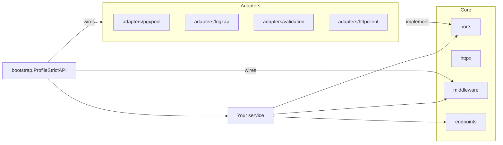

# Hexagonal Architecture Mapping

This repository follows hexagonal (ports and adapters) architecture:

- Core defines domain contracts and HTTP primitives.
- Adapters implement ports for real integrations.
- Bootstrap wires middleware and adapters into a runnable service.

## Layer Map

Core (stable):
- `ports`: interfaces for logging, storage, policy engines, etc.
- `httpx`: HTTP helpers (problem details, responses).
- `middleware`: request/response middleware with stable defaults.
- `endpoints`: small HTTP handlers (health, docs, version).
- `authorization`, `securityprofile`: authz policy and security profiles.

Adapters (contrib):
- `contrib/adapters/*`: db pools, validators, loggers, id generators, http clients.
- `contrib/integrations/*`: convenience wrappers around adapters.

Bootstrap:
- `contrib/bootstrap`: default profiles and hardened server wiring.

Examples:
- `contrib/examples/*`: runnable recipes and patterns.

## Diagram

## Practical Wiring

1. Define ports in core to avoid vendor lock-in where the boundary can stay generic.
2. Pick adapters (contrib) that implement those ports.
3. Use bootstrap profiles to apply middleware consistently.
4. Keep business logic in handlers/services, not in adapters.

This keeps the core stable while allowing integrations to change independently.

## Stable Boundary Clarifications

- Most of `ports` is intended to stay adapter-neutral and reusable across applications.
- The billing contracts in `ports/billing.go` are a compatibility-sensitive v2 surface. They are currently Stripe-shaped, deprecated for new code, and superseded by the explicit compatibility package `github.com/aatuh/api-toolkit/v2/compat/billing`.
- The database stats contracts in `ports/database.go` are also compatibility-sensitive in v2. They currently mirror pgxpool counters; new generic observability call sites should prefer plain-value snapshots.
- New provider-specific or driver-specific contracts should live in app code, `contrib`, or a dedicated future module instead of widening the stable core package.
- The planned v3 extraction path for these surfaces is documented in `docs/ports-surface.md`.

## Operational Safety Contracts

- Health handlers treat probe configuration as part of the contract: liveness
  and readiness should reflect configured checkers, and detailed dependency
  output should only be exposed when `EnableDetailed` is explicitly enabled.
- `contrib/adapters/txpostgres` keeps transactional cleanup inside the adapter
  boundary: application code gets the caller context for work and commit, while
  deferred rollback uses a short-lived cleanup context so cancellation does not
  strand open transactions.
- `contrib/migrator` treats commit-acknowledgement failures as uncertain state
  instead of as a safe retry path. That state is persisted and must be
  reconciled before the runner continues with later migrations.
- `scheduler.Runner` separates job execution outcome from recorder persistence
  outcome. Recorder write failures are surfaced for operators through logging
  and hooks, but they do not retroactively change a completed job result.
